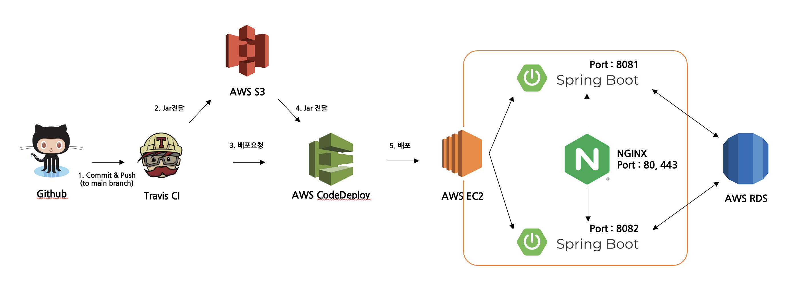

# 게시판 서비스 개발

## 개요
Springboot + JPA를 사용하여 개발한 가장 기본적이고 보편적인 게시판 기능을 둘러볼 수 있는 서비스입니다.
* 기능목록
  * 게시글
    * 게시글 목록(+페이징, 정렬, 검색, n개씩 보기)
    * 게시글 작성
    * 게시글 수정(본인이 작성한 글만)
    * 게시글 삭제(본인이 작성한 글만)
  * 댓글(현재까지는 1대1 댓글)
    * 댓글 목록(+페이징)
    * 댓글 작성
    * 댓글 수정(본인이 작성한 글만)
    * 댓글 삭제(본인이 작성한 글만)
  * 회원가입
  * 로그인

## 개발 환경

* Intellij IDEA Ultimate
* Java 17
* Gradle 7.6.1
* Spring Boot 2.7.10

## 기술 세부 스택


Spring Boot
* Spring Boot Actuator
* Spring Web
* Spring Data JPA
* Spring Security
* ~~Rest Repositories~~
* ~~Rest Repositories HAL Explorer~~
* Thymeleaf
* H2 Database
* MySQL Driver
* Lombok
* Spring Boot DevTools

그 외
* QueryDSL 5.0.0
* Bootstrap 5.2.3
* JavaScript

## Package Design
```
  └── src
    ├── main
    │   ├── java
    │   │     └── io.mykim.projectboard
    │   │            ├── ProjectBoardApplication(C)
    │   │            ├── article
    │   │            │    ├── api
    │   │            │    │    │── ArticleApiController(C)
    │   │            │    │    └── ArticleCommentApiController(C)
    │   │            │    ├── controller
    │   │            │    │    └── ArticleViewController(C)    
    │   │            │    ├── dto
    │   │            │    │    │── request
    │   │            │    │    │      │── ArticleCommentCreateDto(C)
    │   │            │    │    │      │── ArticleCommentEditDto(C)
    │   │            │    │    │      │── ArticleCreateDto(C)
    │   │            │    │    │      │── ArticleEditDto(C)
    │   │            │    │    │      └── ArticleSearchCondition(C)
    │   │            │    │    └── response
    │   │            │    │           │── ResponseArticleCommentFindDto(C)
    │   │            │    │           │── ResponseArticleCommentListDto(C)
    │   │            │    │           │── ResponseArticleFindDto(C)
    │   │            │    │           └── ResponseArticleListDto(C)
    │   │            │    ├── entity
    │   │            │    │    │── Article(C)
    │   │            │    │    └── ArticleComment(C)
    │   │            │    ├── repository
    │   │            │    │    │── ArticleCommentRepository(I)
    │   │            │    │    │── ArticleCommentQuerydslRepository(I)
    │   │            │    │    │── ArticleCommentQuerydslRepositoryImpl(C)
    │   │            │    │    │── ArticleRepository(I)
    │   │            │    │    │── ArticleQuerydslRepository(I)
    │   │            │    │    └── ArticleQuerydslRepositoryImpl(C)
    │   │            │    └── service
    │   │            │         │── ArticleCommentService(C)
    │   │            │         └── ArticleService(C)
    │   │            ├── global
    │   │            │    ├── config
    │   │            │    │    │── jpa
    │   │            │    │    │     │── BaseEntity(C)
    │   │            │    │    │     │── BaseTimeEntity(C)
    │   │            │    │    │     └── JpaConfig(C)
    │   │            │    │    │── security
    │   │            │    │    │     │── handler(C)
    │   │            │    │    │     │       │── CustomAccessDeniedHandler(C)
    │   │            │    │    │     │       │── CustomAuthenticationEntryPoint(C)
    │   │            │    │    │     │       │── CustomAuthenticationFailureHandler(C)
    │   │            │    │    │     │       └── CustomAuthenticationSuccessHandler(C)
    │   │            │    │    │     │── CustomAuthenticationProvider(C)
    │   │            │    │    │     │── CustomUserDetailsService(C)
    │   │            │    │    │     │── PrincipalDetail(C)
    │   │            │    │    │     └── SpringSecurityConfig(C)
    │   │            │    │    └── web
    │   │            │    │          └── WebServerCustomizer(C)
    │   │            │    ├── result
    │   │            │    │    │── enums
    │   │            │    │    │     │── CustomErrorCode(E)
    │   │            │    │    │     └── CustomSuccessCode(E)
    │   │            │    │    │── error
    │   │            │    │    │     └── ErrorPageController(C)
    │   │            │    │    │── exception
    │   │            │    │    │     │── BusinessRollbackException(C)
    │   │            │    │    │     │── DuplicateUserInfoException(C)
    │   │            │    │    │     │── NotAllowedUserException(C)
    │   │            │    │    │     │── NotFoundException(C)
    │   │            │    │    │     │── NotValidRequestException(C)
    │   │            │    │    │     └── UnAuthorizedException(C)
    │   │            │    │    │── handler
    │   │            │    │    │     └── GlobalExceptionHandler(C)
    │   │            │    │    └── model
    │   │            │    │          │── CommonResponse(C)
    │   │            │    │          └── ValidationError(C)
    │   │            │    └── result
    │   │            │         │── pagination
    │   │            │         │     │── CustomPaginationRequest(C)
    │   │            │         │     └── CustomPaginationResponse(C)
    │   │            │         └── sort
    │   │            │               └── CustomSortingRequest(C)
    │   │            └── user    
    │   │                 ├── api
    │   │                 │    └── UserApiController(C)
    │   │                 ├── controller
    │   │                 │    └── UserViewController(C)    
    │   │                 ├── dto
    │   │                 │    └── request
    │   │                 │           │── UserCreateDto(C)
    │   │                 │           └── UserInfoDuplicateCheckDto(C)
    │   │                 ├── entity
    │   │                 │    │── User(C)
    │   │                 │    └── UserType(E)
    │   │                 ├── repository
    │   │                 │    └── UserRepository(C)
    │   │                 └── service
    │   │                      └── UserService(C)   
    │   └── resources
    │       ├── static           
    │       │     ├── css
    │       │     │    ├── articles.css
    │       │     │    └── user.css
    │       │     └── js
    │       │          ├── articleComment.js
    │       │          ├── articleCommentApis.js
    │       │          └── signUp.js
    │       ├── templates
    │       │     ├── articles
    │       │     │    ├── create.html
    │       │     │    ├── edit.html
    │       │     │    ├── detail.html
    │       │     │    └── list.html
    │       │     ├── error-page
    │       │     │    ├── 403.html
    │       │     │    ├── 404.html
    │       │     │    └── 500.html
    │       │     ├── fragments
    │       │     │    ├── bodyFooter.html
    │       │     │    ├── bodyHeader.html
    │       │     │    └── header.html
    │       │     └── users
    │       │          ├── sign-in.html
    │       │          └── sign-up.html    
    │       ├── data.sql           
    │       └── application.yaml
    ├── test
    │   ├── java
    │   │     └── io.mykim.projectboard
    │   │            ├── ProjectBoardApplicationTests(C)
    │   │            ├── article
    │   │            │    ├── api
    │   │            │    │    │── ArticleApiControllerTest(C)
    │   │            │    │    └── ArticleCommentApiControllerTest(C)
    │   │            │    ├── controller
    │   │            │    │    └── ArticleViewControllerTest(C)    
    │   │            │    └── service
    │   │            │         │── ArticleCommentServiceTest(C)
    │   │            │         └── ArticleServiceTest(C)
    │   │            ├── config
    │   │            │    ├── WithAuthUser(A)
    │   │            │    └── WithAuthUserSecurityContextFactory(C)
    │   │            ├── init(Disabled)
    │   │            │    ├── DataRestTest(C)
    │   │            │    └── JpaRepositoryTest(C)
    │   │            └── user    
    │   │                 ├── api
    │   │                 │    └── UserApiControllerTest(C)
    │   │                 ├── controller
    │   │                 │    └── UserViewControllerTest(C)    
    │   │                 └── service
    │   │                      └── UserServiceTest(C)   
    │   └── resources
    │       └── application.yaml
```

## 데모 페이지
url :http://ec2-3-36-158-39.ap-northeast-2.compute.amazonaws.com:8080

## CI/CD Structure


## Reference
* 유즈케이스 다이어그램 [#5](https://github.com/mykim8710/project-board/pull/5)
  https://app.diagrams.net/#Hmykim8710%2Fproject-board%2Fmain%2Fdocument%2Fproject-board.drawio.svg

* ERD 다이어그램 [#8](https://github.com/mykim8710/project-board/pull/8)
  https://app.diagrams.net/#Hmykim8710%2Fproject-board%2Fmain%2Fdocument%2Fproject-board_ERD.drawio.svg

* 클래스 다이어그램 [#16](https://github.com/mykim8710/project-board/pull/16)
  https://app.diagrams.net/#Hmykim8710%2Fproject-board%2Fmain%2Fdocument%2Fproject-board_CLASS.drawio.svg

* API Endpoint 구글시트
  https://docs.google.com/spreadsheets/d/1r8QbP8IHxHKV3ZOqgRVC4t4-3RyDnIEKAm7XFUG4RG0/edit#gid=0

* 어드민 서비스

